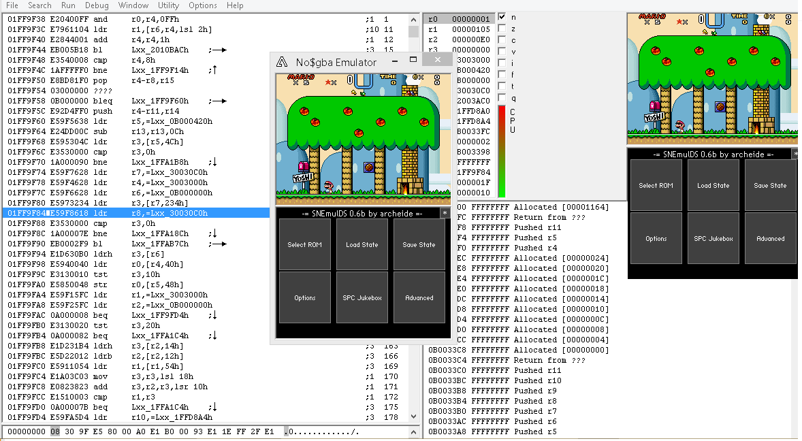

NTR/TWL SDK: TGDS1.65

# SnemulDS 0.6d

s-dd1: s-dd1 coprocessor branch. Keep reading.

Stable Release: 
	- https://bitbucket.org/Coto88/SnemulDS/get/sdd1.zip

Usage:
    - Download [Stable Release] and copy all files from /release/arm7dldi-[ntr/twl], snemul.cfg as well, in SD:/ root. [NDS] mode is for DS mode, and [TWL] for DSi mode. 
	  If it prompts for overwrite: Yes to All. 
    - Create a /snes folder in SD: root, and put your homebrew games on it
	- SPC Playback: Optionally, create a /spc folder in SD: root, and put your SPC files on it. You can choose and play a SPC File in the "SPC Jukebox" option. 
	- [NTR]: Now open loader (internal, hbmenu or other), and run ToolchainGenericDS-multiboot.nds. Then select SnemulDS.nds from the menu, choose ARG (A button) and select the snes file to run.
	- [TWL]: Now open TWiLightMenu (you must set it up first, so you can run TWL mode apps), and run ToolchainGenericDS-multiboot.srl. Then select SnemulDS.srl from the menu, choose ARG (A button) and select the snes file to run.

Gameboy Macro Mode:
	- Option selectable from the touchscreen User Interface. 
	
Save / Load States:
	- It is experimental. It may or not work. It's recommended to always save then restore a single state at a time.

Properly Saving / Loading SRAM:
	- Save in-game, check Options -> SRAM saving and wait for a "SRAM written" message to appear. 

Screen Sync (Vblank Enabled / Vblank Disabled):
	- If the game is running too fast, enable Vblank. Some specific games will need Vblank disabled.
	Vblank fast forces the emulator to draw a whole frame, preventing frameskips, but won't slow down to sync to NDS Vblank interrupts. (fixes TWL mode to match NTR mode rendering speed)
	Vblank full forces the emulator + NDS Vblank interrupt to draw a whole frame, preventing frameskips. Cause massive slowdown, even more in TWL mode due to ARM9i Vblank bug, but required for some games.
	
	Recommended setting is Vblank fast to get a smooth framerate while fast rendering.
	

#################################################################################################
Changelog:

SnemulDS 0.6d:
	- Added S-DD1 co processor support! Street Fighter Alpha 2 is fully playable now. Star Ocean is UNSUPPORTED. TWL mode ONLY. Because the NTR CPU is too slow to handle this co processor. (tweak sprite priority settings if necessary)
	- fixed even more CPU bugs. This narrows down games not booting due to cross-boundary pages or to APU synchronization issues!
	
SnemulDS 0.6c:
	- fix TWL mode touchscreen!
	
SnemulDS 0.6c alpha:
	- TWL support! Currently tested on no&gba. Some lag may happen between loading screens. 
	- Fixed a ton of issues (a work of at least 3 years, related with TGDS SDK, mostly memory issues, codebase stability, interrupts, arm7 dldi support, arm7 sd twl support, etc)
	- Fixed codebase mostly to have a better user-experience, and of course all the changes were merged into NTR version as well.
	
SnemulDS 0.6b:
	- Fix compatibility with more cards, also restored compatibility to be the same as the one developed by Archeide.

SnemulDS 0.6a:
	- A ton of stuff. Add SnemulDS to TGDS. NTR mode only.

SnemulDS 0.6:
	- used old SnemulDSx sources, which were broken.

Known issues:
	-   Fix Mode 0 (no transparency/broken)

Many thanks to:

Archeide for the emulator & source code
Bubble2k for CPU core
Gladius for Sound Core
PeterLemon for CPU tests
#################################################################################################

Coto.